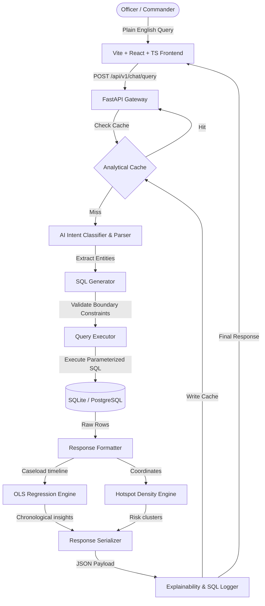

# KSP Sentinel AI — Investigation Operations Engine

A premium, production-grade Natural Language Processing (NLP) database query engine and crime analytics platform custom-built for a Karnataka command center. 

This platform translates plain-English search queries (e.g., *"Show theft cases in Mysuru under investigation registered last month"*) into parameterized SQL, matches suspect profiles, analyzes density hotspots, projects chronological caseload trends, and generates explanatory pipelines detailing extracted intents and raw database queries.

---

## 🏗️ Architecture & Pipeline Flow



---

## 🛠️ Tech Stack

### Backend
- **FastAPI**: Lightweight, asynchronous web framework.
- **SQLAlchemy (ORM)**: Clean data abstraction with parameterization to eliminate SQL Injection risks.
- **RapidFuzz**: High-performance Levenshtein distance matching for entity correction.
- **Statsmodels / Numpy**: Ordinary Least Squares (OLS) regression algorithms and moving averages.
- **Uvicorn**: High-performance ASGI web server.

### Frontend
- **Vite & React (TypeScript)**: Clean rendering, memoized visual components, and modular tab routing.
- **Lucide React**: System symbol iconography.
- **TailwindCSS**: Premium glassmorphism panel styles.

---

## 🚀 Quick Start & Installation

### Backend Setup
1. Navigate to the dataset folder:
   ```bash
   cd dataset
   ```
2. Create and activate a virtual environment:
   ```bash
   python3 -m venv venv
   source venv/bin/activate
   ```
3. Install dependencies:
   ```bash
   pip install -r requirements.txt
   ```
4. Start the backend ASGI server:
   ```bash
   python -m uvicorn app.main:app --host 0.0.0.0 --port 8000
   ```

### Frontend Setup
1. Navigate to the frontend directory:
   ```bash
   cd frontend
   ```
2. Install packages:
   ```bash
   npm install
   ```
3. Run the development server locally:
   ```bash
   npm run dev
   ```
4. Open the operations portal at: `http://localhost:5173/` or `http://localhost:5174/`.

---

## 🔍 API Interface Overview

### 1. Copilot Query Endpoint
- **URL**: `POST /api/v1/chat/query`
- **Payload**:
  ```json
  { "message": "Show theft in Mysuru" }
  ```
- **Response**:
  ```json
  {
    "success": true,
    "intent": "SEARCH_CASES",
    "summary": "Retrieved 3 theft records in Mysuru district.",
    "count": 3,
    "entities": { "crime_head": "theft", "district": "Mysuru" },
    "results": [ ... ],
    "explanation": {
      "intent": "SEARCH_CASES",
      "entities": { "crime_head": "theft", "district": "Mysuru" },
      "reasoning": "Searching historical crime registers matching keyword parameters. Filters applied for theft cases in Mysuru.",
      "filters": ["crime_head=theft", "district=Mysuru"],
      "sql_summary": "SELECT * FROM case_master WHERE crime_head_id = 4 AND district_id = 12 LIMIT 5"
    },
    "metadata": {
      "query_time_ms": 42.15,
      "cache_hit": false
    }
  }
  ```

### 2. Global Analytics Endpoint
- **URL**: `GET /api/v1/analytics/dashboard`
- **Description**: Returns district distributions, top crime categories, monthly timelines, case statuses, age distributions, and gender split statistics. Uses in-memory cache intercepts.

### 3. Diagnostics Health Endpoint
- **URL**: `GET /health`
- **Description**: Verifies database socket readiness, cache availability, application uptime, and exposes request diagnostic counters.

---

## 📂 Project Structure

```
├── dataset/
│   ├── app/
│   │   ├── ai/               # Intent classifiers, entity extractors, insights
│   │   ├── api/routes/       # Endpoints (chat, cases, accused, health)
│   │   ├── core/             # Metrics, cache interceptors, rate limitERS
│   │   ├── database/         # Models, connection pools
│   │   └── main.py           # Application entry point
│   ├── requirements.txt
│   └── test_nlp_suite.py
└── frontend/
    ├── src/
    │   ├── components/       # AIWorkspace (glowing charts, tables, maps)
    │   ├── services/         # API hooks
    │   ├── App.tsx           # Layout shell & routing
    │   └── types.ts          # Standard interface contracts
    └── package.json
```

---

## 📈 Future Roadmaps
1. **Dynamic LLM routing:** Integrate LangChain/LlamaIndex agents to resolve abstract multi-step analytical correlations.
2. **Secure cellular triangulation:** Map towers and biometric files directly into the suspect network graph.
3. **Advanced GIS layering:** Support Mapbox/leaflet coordinate boundaries to visual geo-fences dynamically.
