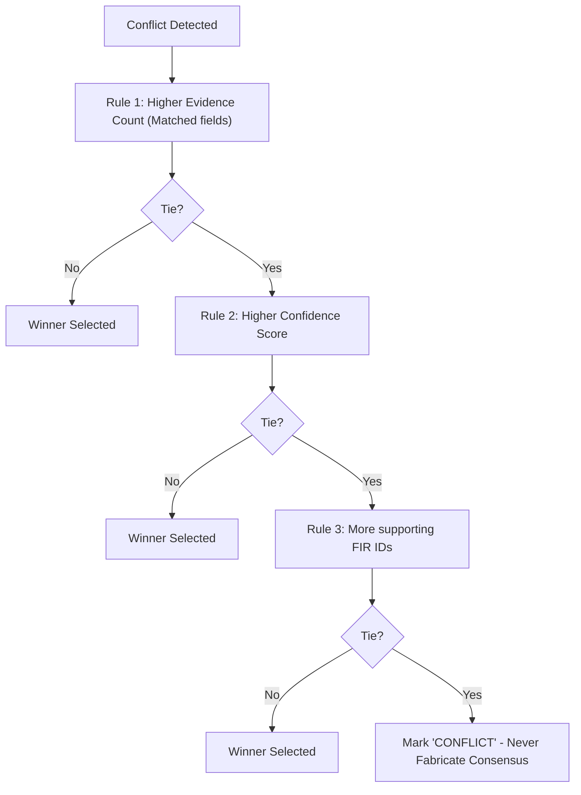

# Agent Conflict Resolution

This document details the deterministic rules used to resolve conflicts when agents report differing finding values.

## ⚖️ Conflict Resolution Priority Rules

## 📋 Conflict Logging Examples
- **Example 1 (Resolved):** `Conflict on key 'accused_count' resolved in favor of evidence_agent value '4' (Rules applied).`
- **Example 2 (Unresolved):** `Conflict on key 'active_parameter' between reporting agents (Tied on all priorities).`
