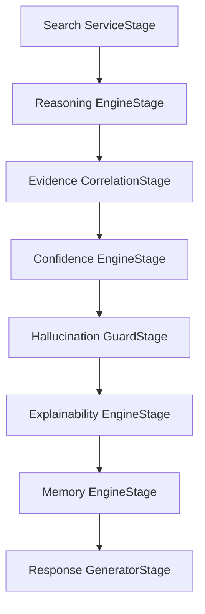

# Evidence Correlation Engine Architecture

This document describes the architectural layout, stage integration, and safety gates of the Enterprise Evidence Correlation Engine.

## 🏗️ Architectural Overview
The Evidence Correlation Engine (`app/ai/evidence_correlation_engine.py`) performs real-time relational analytics across database results. It extracts nodes (FIRs, Accused, Victims, Vehicles, Weapons, Phones) and links them based on attribute overlaps, Geo/date proximity, and suspect lists.

## 🛡️ Safety Gates & Hallucination Defense
To prevent inventing speculative relationships or guessing unsupported links:
1. **Database Evidence Threshold:** A relationship edge is only created between two records if the calculated overlap score meets or exceeds a minimum threshold (15 points).
2. **Fallback Mechanism:** If no links exceed the threshold, the engine immediately yields: `"No verified evidence connecting these records."`
3. **Decoupled Reasoning:** The stage never generates database queries or writes to database tables. It strictly acts as a post-search relational analyzer.
