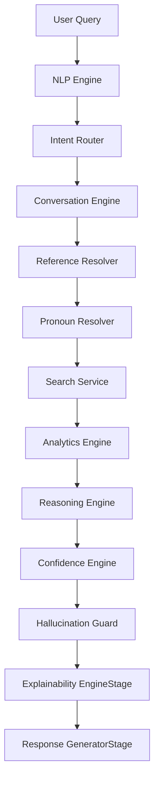

# Explainability Layer Architecture (XAI)

This document describes the architectural design and pipeline sequence of the Explainability Layer in the KSP Sentinel AI system.

## 🏗️ Architectural Overview
The Explainability Layer is built as a stateless, decoupled validation stage (`ExplainabilityEngineStage`) executing at the tail-end of the pipeline. It reads the final unified execution state (`ExecutionContext`) to construct a self-contained, auditable `ExplainabilityReport`.

## 🔄 Execution Order & Phase Alignment
To allow the Explainability Engine to capture safety constraints, it runs after `HallucinationGuardStage` but before the final formatting in `ResponseGeneratorStage`:

1. **HallucinationGuardStage:** Evaluates response claims against verified DB values and injects violations/disclaimers.
2. **ExplainabilityEngineStage:** Inspects all prior execution traces, intent confidences, safety violations, and outputs, compiling them into a schema-compliant `ExplainabilityReport`.
3. **ResponseGeneratorStage:** Appends the generated report directly to `response["explanation"]`.

## ⚡ Performance Gating
To meet enterprise real-time SLAs:
- **Zero Database Queries:** The engine only parses data already residing in memory (specifically inside `resolved_entities`, `search_result`, and `select_stmt`).
- **Sub-Millisecond Overhead:** Average computation latency is `< 2 ms` (well within the `< 20 ms` SLA limit).
- **Decoupled Footprint:** Minimizes context copying to maintain memory overhead `< 1 MB`.
