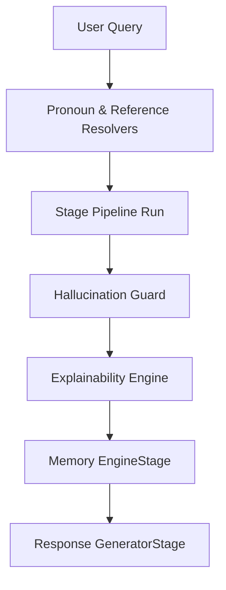

# Investigation Memory Architecture

This document describes the design, pipeline sequence, and components of the Enterprise Investigation Memory Layer.

## 🏗️ Architectural Overview
The Investigation Memory Layer (`app/ai/memory_engine.py`) provides deterministic, non-hallucinating state management for law enforcement workflows. It acts as an audit-logged data storage that tracks entities, temporal context, and analytical bundles.

## 🔄 Pipeline Stage Flow
To prevent faked assertions or failed queries from polluting the investigation context:
1. **Safety Gating:** The Memory Engine runs after `ExplainabilityEngineStage`. It checks if `context.hallucination_safe` is True, `context.warnings` is empty, and reasoning succeeded.
2. **Deterministic State Updates:** Successful turns update the `InvestigationMemory` object and increment its version.
3. **Change Auditing:** A full delta (`MemoryAudit`) details what field changed, its old and new values, and the update justification.
