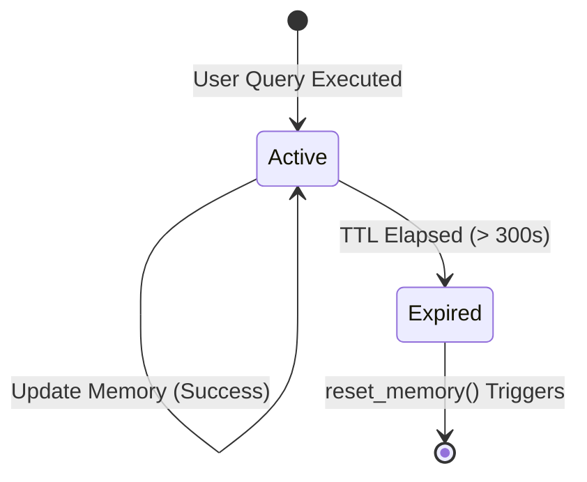

# Memory Lifecycle Reference

This document describes the Time-to-Live (TTL), expiration transitions, and session reset loops in the KSP Sentinel AI Memory Engine.

## 🕒 Configurable Time-To-Live (TTL)
The memory engine enforces a session TTL to prevent officers from making decisions using stale information:
- **Default TTL:** 300 seconds (5 minutes).
- **Configuration:** Modifiable via class attribute `MemoryEngine.TTL_SECONDS` or config overrides.

## 🔄 Lifecycle Transitions
1. **Instantiation:** Triggered on the first successful query.
2. **Access:** Reading memory validates `time.time() - last_updated_time > TTL_SECONDS`.
3. **Reset:** If the session is expired or a explicit reset keyword (`forget`, `reset`, `clear`) is matched, `reset_memory()` deletes active states.
