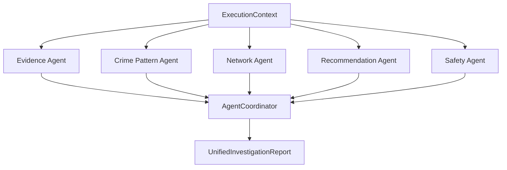

# Multi-Agent Investigation Architecture

This document describes the design, integration sequence, and execution flow of the Enterprise Multi-Agent Investigation Framework.

## 🏗️ Architectural Overview
Instead of executing a single reasoning pass, the system utilizes five specialized, deterministic agents that analyze the `ExecutionContext` independently. The `AgentCoordinator` orchestrates execution, collects results, and applies deterministic priority rules to resolve conflicts.

## 🔄 Stage Sequence
The `MultiAgentEngineStage` executes after `EvidenceCorrelationStage` and before `ConfidenceEngineStage`:

$$\text{Evidence CorrelationStage} \longrightarrow \text{MultiAgentEngineStage} \longrightarrow \text{Confidence EngineStage}$$
