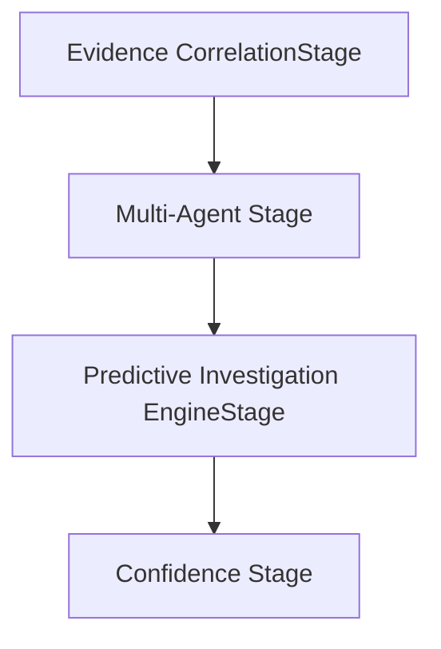

# Predictive Investigation Architecture

This document outlines the architectural design, integration stage sequence, and safety gates of the Enterprise Predictive Investigation Engine.

## 🏗️ Architectural Overview
The Predictive Investigation Engine (`app/ai/predictive_engine.py`) performs deterministic forecasting and resource deployment modeling using database query outputs. It does not contain probabilistic AI models or predictive heuristics; all metrics are calculated deterministically.

## 🔄 Stage Sequence
The `PredictiveEngineStage` runs after `MultiAgentEngineStage` and before `ConfidenceEngineStage`:

$$\text{MultiAgentEngineStage} \longrightarrow \text{PredictiveEngineStage} \longrightarrow \text{Confidence EngineStage}$$
